# Teste Automatizado

Este repositório contém _scripts_ que realizam um teste de vazão de forma padrão e automatizada, com o processamento de dados para a geração de gráficos.

Dessa forma:

- O _script_ [`executa-experimento`](scripts/executa-experimento) realiza a execução dos testes de vazão utilizando o `iperf` e a coleta de métricas de desempenho;

- O _script_ [`sumarizar-experimento`](scripts/sumarizar-experimento.py) realiza o processamento dos dados gerados pelo `iperf` e gera gráficos com os resultados.

## Pré-requisitos

É necessário possuir os seguintes módulos do Python 3 instalados:

- pandas
- matplotlib.pyplot
- numpy
- sys
- json
- csv
- re

### Instalação dos módulos

- openSUSE Tumbleweed
    ```bash
    sudo zypper install --no-recommends python313-pandas python313-matplotlib python313-numpy
    ```

- Debian/Ubuntu
    ```bash
    sudo apt install --no-install-recommends python3-pandas python3-matplotlib python3-numpy
    ```

## Uso

Primeiramente, clone o repositório:

```bash
git clone https://github.com/jpmsb/teste-automatizado-rnp teste-automatizado
```

ou

```bash
git clone https://git.rnp.br/melhorias-monipe/teste-automatizado
```

Em seguida, entre no diretório `scripts`:

```bash
cd teste-automatizado/scripts
```

Abaixo, é demonstrado como utilizar as rotinas:

- `executa-experimento`

    ```bash
    ./executa-experimento -s <comando iperf3 do servidor> -c <comando iperf3 do cliente> -a <nome> -r <repetições>
    ```

    Os argumentos suportados são listados abaixo:

    - [obrigatório] `-c`, `--comando-cliente`: comando do `iperf` do cliente;

    - [obrigatório] `-s`, `--comando-servidor`: comando do `iperf` do servidor;

    - [obrigatório] `-a`, `--apelido`: apelido do teste;

    - [opcional] `-t`, `--duracao`: tempo de execução, em segundos, do teste. Quando não informado, o valor padrão é 10 segundos;

    - [opcional] `-r`, `--rodadas`: quantidade de repetições do teste. Quando não informado, o valor padrão é 1.

    - [opcional] `--receita`: caminho para o arquivo de receita onde os testes e a as configurações de execução estão definidos.

    Exemplo de uso:

    ```bash
    ./executa-experimento -s 'iperf3 -s' -c 'iperf3 -c servidor -A 3,9 -t 600' -r 5 -a "teste"
    ```

    No exemplo acima:

    - O teste será executado com o cliente utilizando o núcleo 3 e o servidor utilizando o núcleo 9;

    - O apelido do teste será `teste`;

    - O teste terá duração de 10 segundos;

    - O teste será repetido 5 vezes.

    Abaixo, é mostrado como ficaria a estrutura de diretórios após a execução do teste:

    ```bash
    .
    resultados/
    ├── teste
    │   ├── rodada_1
    │   │   ├── rodada_1-teste-iperf3_client.csv
    │   │   ├── rodada_1-teste-iperf3_client.json
    │   │   ├── rodada_1-teste-iperf3_server.csv
    │   │   ├── rodada_1-teste-iperf3_server.json
    │   │   ├── rodada_1-teste-mpstat.csv
    │   │   └── rodada_1-teste-mpstat.log
    │   ├── rodada_2
    │   │   ├── rodada_2-teste-iperf3_client.csv
    │   │   ├── rodada_2-teste-iperf3_client.json
    │   │   ├── rodada_2-teste-iperf3_server.csv
    │   │   ├── rodada_2-teste-iperf3_server.json
    │   │   ├── rodada_2-teste-mpstat.csv
    │   │   └── rodada_2-teste-mpstat.log
    │   ├── rodada_3
    │   │   ├── rodada_3-teste-iperf3_client.csv
    │   │   ├── rodada_3-teste-iperf3_client.json
    │   │   ├── rodada_3-teste-iperf3_server.csv
    │   │   ├── rodada_3-teste-iperf3_server.json
    │   │   ├── rodada_3-teste-mpstat.csv
    │   │   └── rodada_3-teste-mpstat.log
    │   ├── rodada_4
    │   │   ├── rodada_4-teste-iperf3_client.csv
    │   │   ├── rodada_4-teste-iperf3_client.json
    │   │   ├── rodada_4-teste-iperf3_server.csv
    │   │   ├── rodada_4-teste-iperf3_server.json
    │   │   ├── rodada_4-teste-mpstat.csv
    │   │   └── rodada_4-teste-mpstat.log
    │   ├── rodada_5
    │   │   ├── rodada_5-teste-iperf3_client.csv
    │   │   ├── rodada_5-teste-iperf3_client.json
    │   │   ├── rodada_5-teste-iperf3_server.csv
    │   │   ├── rodada_5-teste-iperf3_server.json
    │   │   ├── rodada_5-teste-mpstat.csv
    │   │   └── rodada_5-teste-mpstat.log
    │   ├── teste-conf.ini
    │   └── teste-experimento.log

    ```

    No arquivo `teste-experimento.log`, está registrado o conteúdo que é exibido no terminal durante a execução do teste:

    ```
    Início: 2025-09-23 00:24:36

    ##################################################

    Os resultados do experimento serão salvos em ↓:
    /home/bolsistas-monipe/teste-automatizado-rnp/scripts/resultados/teste

    Nome do teste: teste
    Quantidade de rodadas: 5
    Duração de cada rodada: 10 segundos

    ##################################################

    Executando a rodada 1 do teste de 10 segundos...

    Servidor iniciado no núcleo 9...
    Preparando o mpstat...
    Cliente iniciado no núcleo 3...

    ##################################################

    ##################################################

    Executando a rodada 2 do teste de 10 segundos...

    Servidor iniciado no núcleo 9...
    Preparando o mpstat...
    Cliente iniciado no núcleo 3...

    ##################################################

    ##################################################

    Executando a rodada 3 do teste de 10 segundos...

    Servidor iniciado no núcleo 9...
    Preparando o mpstat...
    Cliente iniciado no núcleo 3...

    ##################################################

    ##################################################

    Executando a rodada 4 do teste de 10 segundos...

    Servidor iniciado no núcleo 9...
    Preparando o mpstat...
    Cliente iniciado no núcleo 3...

    ##################################################

    ##################################################

    Executando a rodada 5 do teste de 10 segundos...

    Servidor iniciado no núcleo 9...
    Preparando o mpstat...
    Cliente iniciado no núcleo 3...

    ##################################################

    Fim: 2025-09-23 00:25:03
    ```


- `sumarizar-experimento`

    ```bash
    ./sumarizar-experimento.py -d <diretório de resultados> -t <apelido_teste_1> -t <apelido_teste_2> ... -t <apelido_teste_n>
    ```

    Os argumentos suportados são listados abaixo:

    - [obrigatório] `-d`, `--diretorio`: diretório onde estão os arquivos de resultados dos testes. É neste diretório que os gráficos gerados serão salvos, de acordo com o contexto de cada um. Por exemplo, gráficos que contenham informação sobre uma rodada de um teste, serão salvos em um diretório com o nome da rodada;

    - [obrigatório] `-t`, `--teste`: apelidos dos testes que serão sumarizados. Estes apelidos são os mesmos informados no momento da execução do teste.

    Exemplo de uso:

    ```bash
    ./sumarizar-experimento.py -d /home/resultados -t "teste_1" -t "teste_2" -t "teste_3"
    ```

    A saída no terminal será algo como:

    ```bash
    Processando Teste 1 ...

    Resumo para Teste 1:

    Uso de CPU por núcleo:
        CPU 0: 5.39%
        CPU 1: 52.44%
        CPU 2: 65.58%
        CPU 3: 0.61%

    Vazão:
    Origem    Vazão (Mbps)   
    Cliente   9891.86        
    Servidor  9787.17        

    Perda (%):
    Média     0.10           

    Processando Teste 2 ...

    Resumo para Teste 2:

    Uso de CPU por núcleo:
        CPU 0: 5.41%
        CPU 1: 52.29%
        CPU 2: 64.91%
        CPU 3: 0.45%

    Vazão:
    Origem    Vazão (Mbps)   
    Cliente   9817.41        
    Servidor  9747.93        

    Perda (%):
    Média     0.04           

    Processando Teste 3 ...

    Resumo para Teste 3:

    Uso de CPU por núcleo:
        CPU 0: 5.57%
        CPU 1: 52.09%
        CPU 2: 65.53%
        CPU 3: 0.57%

    Vazão:
    Origem    Vazão (Mbps)   
    Cliente   9890.62        
    Servidor  9774.49        

    Perda (%):
    Média     0.10
    ```

    São gerados gráficos nos formatos **png** e **svg**. Abaixo estão alguns exemplos:

    - Gráficos de barras:

        - Gráficos de uso de CPU:

            - Comparação geral dos testes:
                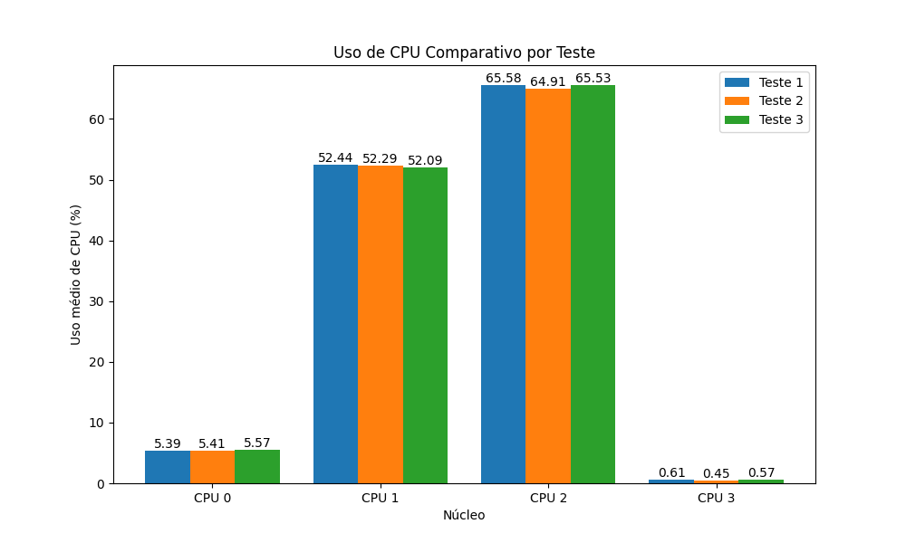

            - Comparação entre as rodadas rodada do teste 1:
                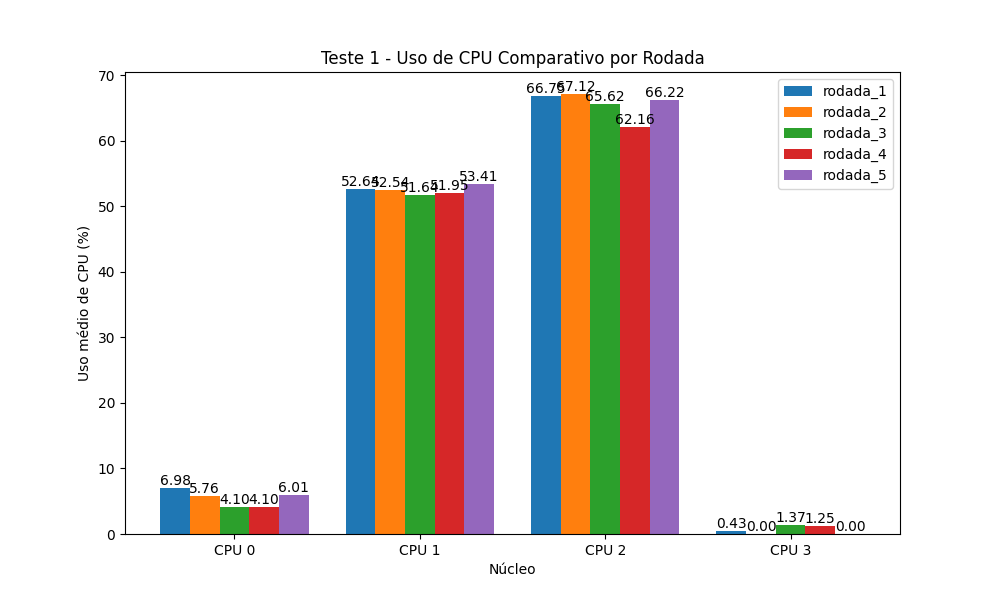

            - Média das rodadas do teste 1:

                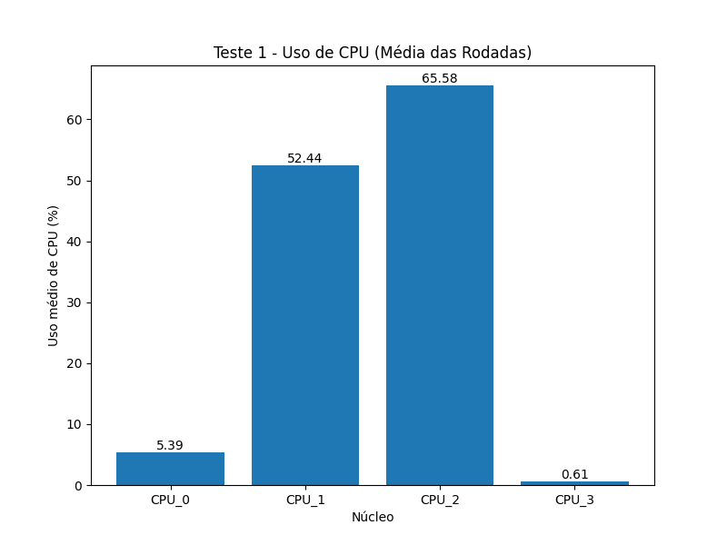

        - Gráficos de vazão:

            - Comparação geral dos testes:
                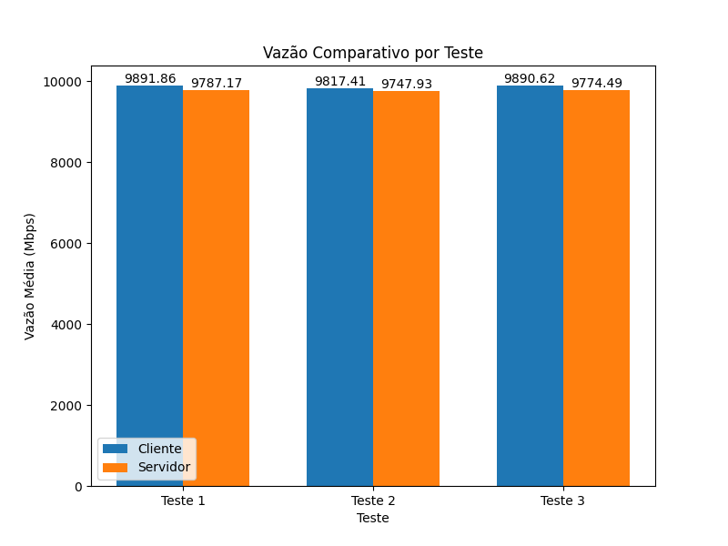

            - Comparação entre as rodadas do teste 1:
                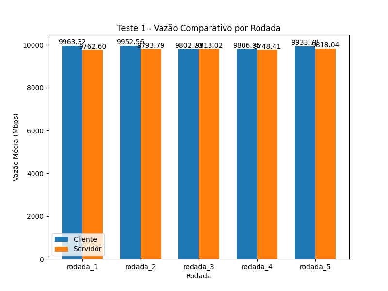

            - Média das rodadas do teste 1:
                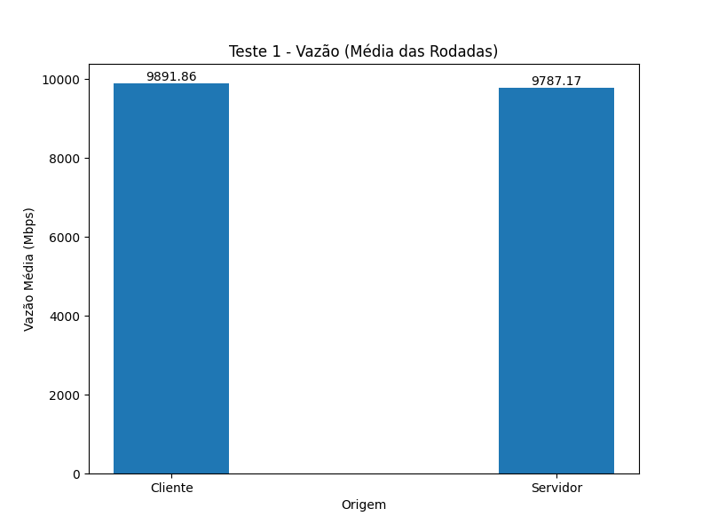

        - Gráficos de perda:

            - Comparação geral dos testes:
                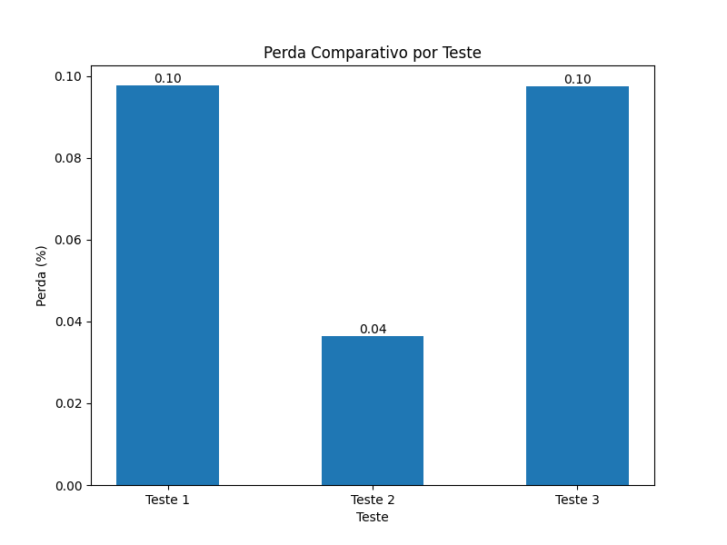

            - Comparação entre as rodadas do teste 1:
                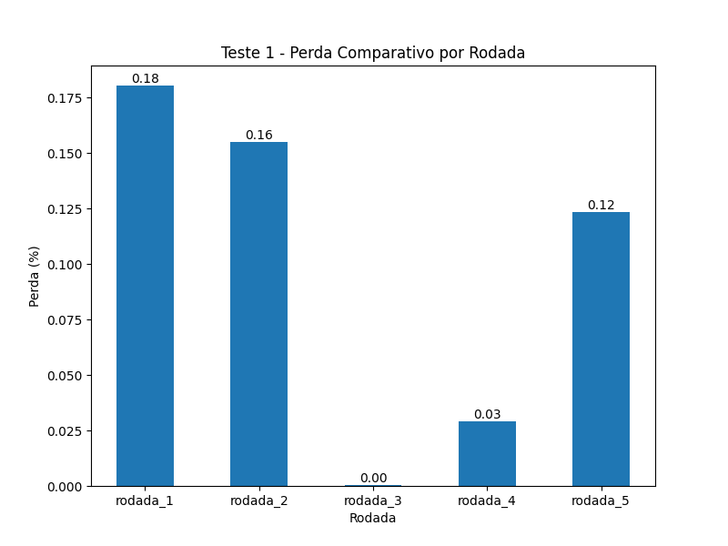

            - Média das rodadas do teste 1:
                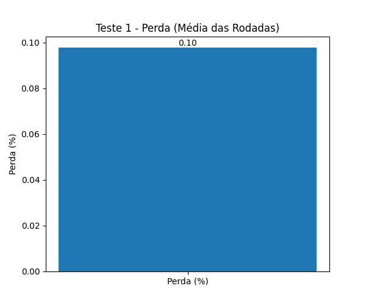

    - Gráficos de série temporal:

        - Gráficos de uso de CPU:

            - Média das rodadas do teste 1:
                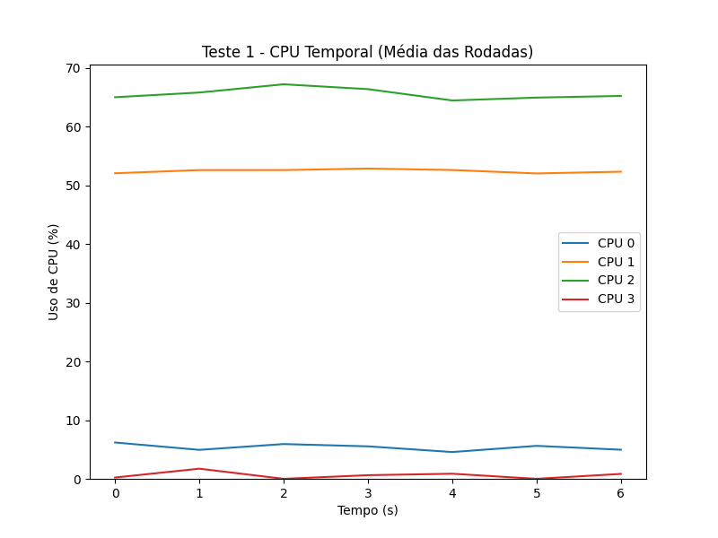

        - Gráficos de vazão:

            - Média das rodadas do teste 1:
                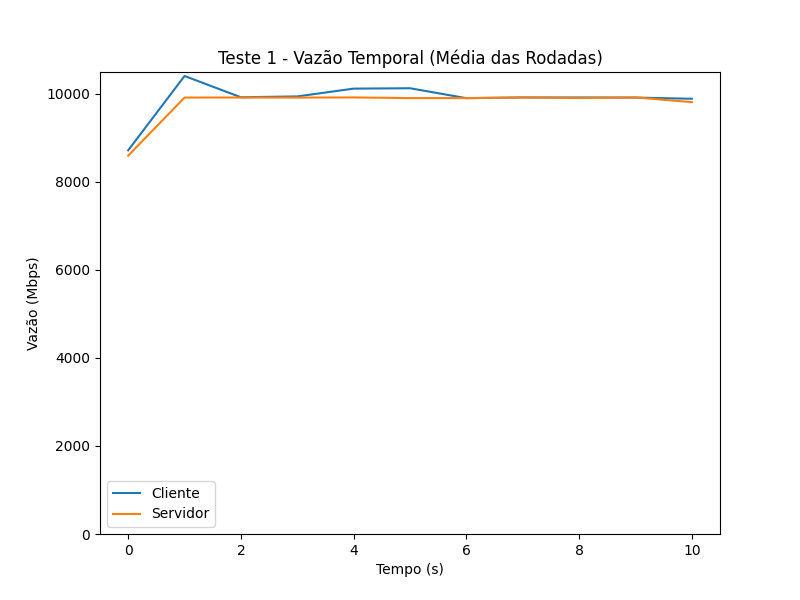

        - Gráficos de perda:

            - Média das rodadas do teste 1:
                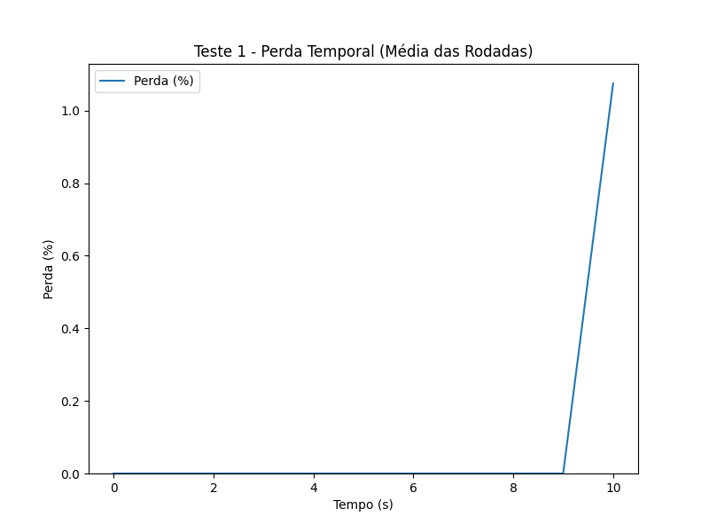


### Utilização da receita de testes

Para facilitar a execução de múltiplos testes de forma automatizada, é possível utilizar uma receita contendo a especificação de cada teste, além da definição dos parâmetros de execução de todo o experimento.

Abaixo, está um exemplo do formato da receita de testes:

```ini
[Receita]
Nome=Teste Receita
Descricao=Experimento de teste com receita
Rodadas=3
TempoDaRodada=15
Sumarizador=./sumarizar-experimento.py -d $DIR_RESULTADOS -t $Teste[1] -t $Teste[2] -t $Teste[3]

[Teste]
Nome=Teste 1
Descricao=Teste A
PreparoAntes=script_preparo_antes_A
PreparoDepois=script_preparo_depois_A
ComandoCliente=iperf3 -c cliente -A 3,7 -w 8m -t 10 -P 2
ComandoServidor=iperf3 -s -A 1

[Teste]
Nome=Teste 2
Descricao=Teste B
PreparoAntes=script_preparo_antes_B
PreparoDepois=script_preparo_depois_B
ComandoCliente=iperf3 -c cliente --skip-rx-copy -A 3,8 -w 8m -t 10
ComandoServidor=iperf3 -s

[Teste]
Nome=Teste 3
Descricao=Teste C
PreparoAntes=script_preparo_antes_C
PreparoDepois=script_preparo_depois_C
ComandoCliente=iperf3 -c cliente --skip-rx-copy -A 3,9 -w 8m -t 10 -P 2
ComandoServidor=iperf3 -s -A 1
```

A seguir, é explicado o que cada seção e parâmetro da receita significa:

- Seção `[Receita]`:
    - [obrigatório] `Nome`: nome da receita, podendo conter espaços;
    - [opcional] `Descricao`: descrição da receita;
    - [opcional] `Rodadas`: quantidade de rodadas por teste. Quando não informado, o valor padrão é 2 rodadas;
    - [opcional] `TempoDaRodada`: tempo de execução, em segundos, de cada rodada. Quando não informado, o valor padrão é 10 segundos;
    - [opcional] `Sumarizador`: comando que será executado após a execução de todos os testes. Pode ser o comando exato que será utilizado ou é possível utilizar as variáveis `$DIR_RESULTADOS` e `$Teste[n]`, onde `n` é o número do teste, para referenciar o diretório de resultados e o nome do teste, respectivamente. Por exemplo: `./sumarizar-experimento.py -d $DIR_RESULTADOS -t $Teste[1] -t $Teste[2] -t $Teste[3]`. Os números correspondem à ordem de definição dos testes na receita.

- Seção `[Teste]`:
    - [obrigatório] `Nome`: nome do teste, podendo conter espaços;
    - [opcional] `Descricao`: descrição do teste;
    - [opcional] `PreparoAntes`: comando que será executado antes da execução do teste. Pode ser utilizado para preparar o ambiente, como reiniciar serviços, limpar caches etc;
    - [opcional] `PreparoDepois`: comando que será executado após a execução do teste. Pode ser utilizado para limpar o ambiente, como reiniciar serviços, limpar caches, etc;
    - [obrigatório] `ComandoCliente`: comando do `iperf3` do cliente;
    - [obrigatório] `ComandoServidor`: comando do `iperf3` do servidor.

Para comentar algum parâmetro, basta utilizar o caractere `;` no início da linha:

```ini
[Receita]
Nome=Teste Receita
Descricao=Experimento de teste com receita
Rodadas=3
TempoDaRodada=15
; Sumarizador=./sumarizar-experimento.py -d $DIR_RESULTADOS -t $Teste[1] -t $Teste[2] -t $Teste[3]

[Teste]
Nome=Teste 1
Descricao=Teste A
; PreparoAntes=script_preparo_antes_A
PreparoDepois=script_preparo_depois_A
ComandoCliente=iperf3 -c cliente -A 3,7 -w 8m -t 10 -P 2
ComandoServidor=iperf3 -s -A 1
```

Além disso, é possível sobrescrever os parâmetros `TempoDaRodada` e `Rodadas` usando os argumentos `-t` e `-r`, respectivamente, diretamente na rotina `executa-experimento`:

```bash
./executa-experimento -r 5 -t 15 --receita receita
```

No comando acima, o teste será executado com 5 rodadas e cada rodada terá duração de 15 segundos, mesmo que outros valores para esses parâmetros já estejam definidos na receita. Com isso, a ordem de precedência dos parâmetros é a seguinte:

- Duração da rodada:
    1. Argumento `-t` da rotina `executa-experimento`;
    2. Parâmetro `TempoDaRodada` da receita;
    3. Argumento `-t` do comando `iperf3` do cliente, caso esteja definido;
    4. Valor padrão de 10 segundos.

- Quantidade de rodadas:
    1. Argumento `-r` da rotina `executa-experimento`;
    2. Parâmetro `Rodadas` da receita;
    3. Valor padrão de 2 rodadas.

Os resultados são armazenados dentro do diretório `resultados/<nome_receita>`, onde `<nome_receita>` é o valor do parâmetro `Nome` da seção `[Receita]`, com espaços substituídos por `_`. Por exemplo, para o caso da receita de exemplo acima, os resultados seriam armazenados em `resultados/Teste_Receita`.